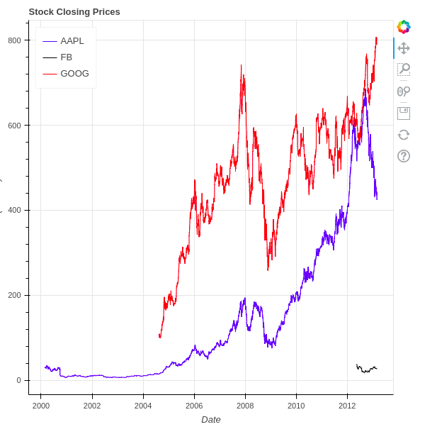

# Data Visualizer  

> Small program made in python using numpy and bokeh to create an HTML file that allows to  
show graphics on the browser

## Tools  

* python >=3.6.9  
* numpy >=1.21.1  
* bokeh >=2.3.3  

## Getting started  

* git clone the project -   
* pip install -r requirements.txt  
* python3 visualize_data.py  
    [this is going to run code, create an HTML file and open it on the browser]  

### credits  
[copyassignment.com]

